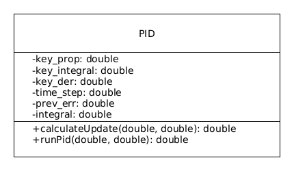
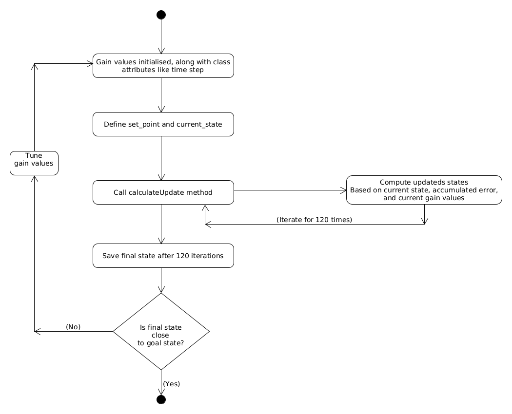

# Week 5: Test-Driven Development Assignment - ENPM 808X

## Overview

This repository pertains to the test driven development exercise. The group members of which are :

- Sai Surya Sriramoju
- Krishna Rajesh Hundekari
- Shivam sehgal
- Abrarudiin Syed

# C++ Boilerplate v2 Badges
 [](https://codecov.io/gh/Surya-Sriramoju/TDD_pid_controller) [](LICENSE)


## Part 1 
The members of the pair for Part 1 of this repository are :
 - Sai Surya Sriramoju (Driver)
 - Krishna Rajesh Hundekari (Navigator)

 ## Part 2 
The members of the pair for Part 2 of this repository are :
 - Abrarudiin Syed (Navigator)
 - Shivam sehgal (Driver)
 
## Description
The design contains one class, PID. The main function takes the current and goal state as input to pid class which should be initialized with kp, ki, kd and dt values.


The UML class diagram is as follows : 

Fig 1 : UML class diagram 
 


Fig 2 : Activity diagram 
 


## Steps to build the library and run test cases
``` bash
# Configure the project and generate a native build system:
  # Must re-run this command whenever any CMakeLists.txt file has been changed.
  cmake -S ./ -B build/
# Compile and build the project:
  # rebuild only files that are modified since the last build
  cmake --build build/
  # or rebuild everything from scracth
  cmake --build build/ --clean-first
  # to see verbose output, do:
  cmake --build build/ --verbose
# Run tests:
  cd build/; ctest; cd -
# Clean and start over:
  rm -rf build/
```


## Steps to geneate code coverage report
```bash
# if you don't have gcovr or lcov installed, do:
  sudo apt-get install gcovr lcov
# Set the build type to Debug and WANT_COVERAGE=ON
  cmake -D WANT_COVERAGE=ON -D CMAKE_BUILD_TYPE=Debug -S ./ -B build/
# Now, do a clean compile, run unit test, and generate the coverage report
  cmake --build build/ --clean-first --target all test_coverage
# open a web browser to browse the test coverage report
  open build/test_coverage/index.html

